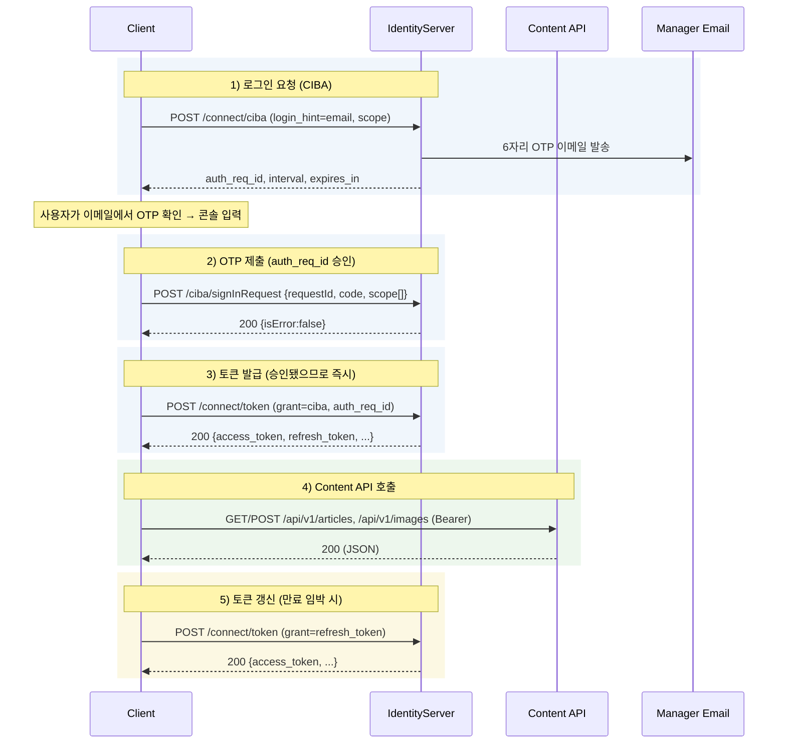

# Authentication Flow — CIBA (OpenID Connect Client-Initiated Backchannel Authentication)

## 개요

이 샘플은 매니저 계정 이메일 OTP로 로그인하기 위해 **CIBA** 흐름을 사용합니다. Duende IdentityServer 기반이며, 별도의 클라이언트 SDK 의존성이 없습니다.

표준 순수 CIBA 폴링과 달리, CloudHospital 구현은 **사용자가 받은 OTP를 클라이언트가 `/ciba/signInRequest` 로 제출해 요청을 승인**시킨 뒤 토큰을 발급받습니다. 승인이 끝난 상태라 토큰 요청은 폴링 없이 1회로 성공합니다.

## 시퀀스 다이어그램



## 엔드포인트 상세

클라이언트 인증: `/connect/*` 는 **HTTP Basic**(`base64(client_id:client_secret)`)을 사용합니다(서버가 허용). `/ciba/signInRequest` 는 별도 클라이언트 인증 없이 JSON 으로 호출합니다.

### 1) CIBA authorization request

```
POST {STS_ISSUER}/connect/ciba
Content-Type: application/x-www-form-urlencoded
Authorization: Basic base64(client_id:client_secret)

scope=openid profile email offline_access hospital-content-api
&login_hint=manager@hospital.example.com
```

응답:

```json
{
  "auth_req_id": "b0e3...9c",
  "expires_in": 300,
  "interval": 5
}
```

주의:
- `scope` 에 `offline_access` 가 있어야 `refresh_token` 이 발급됨.
- `binding_message` 파라미터도 보낼 수 있으나(여러 세션 구분용) 이 샘플은 사용하지 않음.

### 2) OTP 제출 (sign-in request)

사용자가 이메일로 받은 6자리 OTP를 제출해 `auth_req_id` 를 승인합니다.

```
POST {STS_ISSUER}/ciba/signInRequest
Content-Type: application/json

{
  "requestId": "b0e3...9c",       // 1)의 auth_req_id
  "code": "123456",               // 이메일 OTP
  "scope": ["openid","profile","email","offline_access","hospital-content-api"]
}
```

응답:

```json
{ "subject": "…", "isError": false, "error": null, "errorDescription": null }
```

주의:
- HTTP 200 이라도 `isError: true` 면 코드 오류/만료 → 실패로 처리(에러 메시지는 `errorDescription`).
- `scope` 는 문자열 배열(`/connect/*` 의 공백 구분 문자열과 다름).

### 3) Token

2)에서 승인됐으므로 폴링 없이 1회로 토큰을 받습니다.

```
POST {STS_ISSUER}/connect/token
Content-Type: application/x-www-form-urlencoded
Authorization: Basic base64(client_id:client_secret)

grant_type=urn:openid:params:grant-type:ciba
&auth_req_id=b0e3...9c
```

응답 (성공):

```json
{
  "access_token": "eyJ...",
  "token_type": "Bearer",
  "expires_in": 3600,
  "refresh_token": "def50200...",
  "id_token": "eyJ...",
  "scope": "openid profile email offline_access hospital-content-api"
}
```

서버 반영 지연 대비로 샘플은 짧은 폴링 폴백을 둡니다:

| error | 의미 | 처리 |
|---|---|---|
| `authorization_pending` | 승인 반영 대기 | interval 후 재시도 |
| `slow_down` | 폴링 과다 | interval 증가 후 재시도 |
| `expired_token` | auth_req_id 만료 | 1단계부터 재시작 |
| `access_denied` | 거부됨 | 종료 |

### 4) Refresh token

```
POST {STS_ISSUER}/connect/token
Content-Type: application/x-www-form-urlencoded
Authorization: Basic base64(client_id:client_secret)

grant_type=refresh_token
&refresh_token=def50200...
&scope=openid profile email offline_access hospital-content-api
```

응답: 3) 성공 응답과 동일. 서버가 `refresh_token` 을 회전(rotate)하지 않으면 응답에 없을 수 있으므로, **응답에 없으면 기존 값을 유지**한다(`refresh_token ?? 기존값`).

## Content API 호출

발급된 `access_token`(audience `hospital-content-api`)을 Bearer 로 부착해 **Content API 서버(`API_BASE_URL`)** 를 호출합니다. IdentityServer가 아니라 별도 API 호스트입니다.

```
POST {API_BASE_URL}/api/v1/articles
Authorization: Bearer {access_token}
Accept: application/json
Content-Type: application/json
```

주요 엔드포인트:

| 용도 | 메서드 · 경로 |
|---|---|
| 아티클 목록 / 생성 | `GET` / `POST` `/api/v1/articles` |
| 아티클 조회 / 수정 / 삭제 | `GET` / `PUT` / `PATCH` / `DELETE` `/api/v1/articles/{articleId}` |
| SaaS 반영(재검증) | `POST` `/api/v1/articles/{articleId}/revalidate` |
| 이미지 업로드 | `POST` `/api/v1/images` (multipart/form-data, 필드명 `files`) |

- 이 엔드포인트들은 병원 LocalManager 계정(=`hospital-content-api` audience)에 노출됩니다. 발행은 별도 엔드포인트 없이 `status` 필드(`Active`)로 제어하고, 공개 반영은 `revalidate` 로 처리합니다(자세한 내용은 [README](../README.md#콘텐츠-발행과-revalidate)).

### 401 처리

- `access_token` 만료 → refresh_token 으로 새 토큰 발급 후 1회 재시도
- refresh 도 실패 → 사용자에게 재로그인 요청 (CIBA 1단계부터)

### 429 처리

- `Retry-After` 헤더 존중, 없으면 지수 백오프 (2^n 초, 최대 3회)

## 보안 주의사항

- `client_secret`, `refresh_token`, `.tokens.json` 은 절대 소스 저장소에 커밋 금지. `.gitignore` 로 차단.
- 프로덕션 환경에서는 토큰을 OS keychain 또는 안전한 secret manager 에 저장. 로컬 파일은 개발용.
- 매니저 계정 자격증명·OTP 채널 유출 의심 시 즉시 클라우드호스피탈에 통지 → 계정 정지 + 토큰 회수 (약관 §11).

## 참조

- [OpenID Connect CIBA 1.0](https://openid.net/specs/openid-client-initiated-backchannel-authentication-core-1_0.html)
- [Duende IdentityServer CIBA docs](https://docs.duendesoftware.com/identityserver/v7/tokens/ciba/)
- [RFC 6749 §6 — Refresh Token](https://datatracker.ietf.org/doc/html/rfc6749#section-6)
