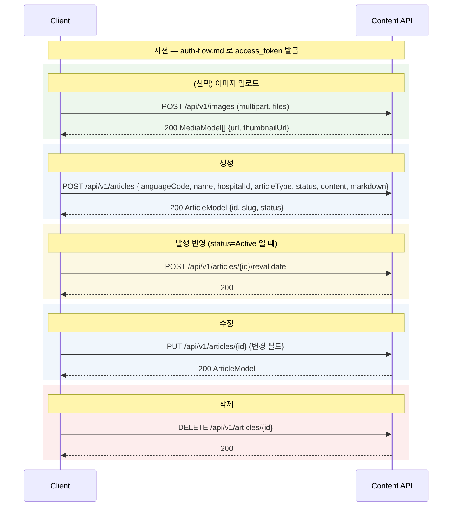

# Content API Flow — 아티클 생성 · 수정 · 삭제

## 개요

병원 매니저(LocalManager) 계정으로 발급받은 `access_token`(audience `hospital-content-api`)을 사용해 **Content API 서버(`API_BASE_URL`)** 에서 아티클을 관리하는 흐름입니다. 인증(토큰 발급)은 [auth-flow.md](auth-flow.md) 를 참고하세요.

모든 요청에 공통으로 붙습니다:

```
Authorization: Bearer {access_token}
Accept: application/json
Content-Type: application/json      # 이미지 업로드는 multipart/form-data
```

핵심 개념:
- **발행 여부는 `status` 필드로 제어** (`Draft` / `Active` / `Archived`). 별도 publish 엔드포인트 없음.
- 발행(`Active`) 후 **공개 사이트 반영은 `/revalidate`** 로 트리거 (자세한 내용: [README](../README.md#콘텐츠-발행과-revalidate)).
- 아티클은 언어별 번역을 가지며, `languageCode` 로 대상 번역을 지정 (목록/조회도 이 언어로 필터링됨).

## 시퀀스 다이어그램



## 엔드포인트 상세

### 1) 이미지 업로드 (선택)

본문/커버에 넣을 이미지를 먼저 업로드해 공개 URL을 받습니다. **래스터 포맷만 지원** (JPEG/PNG/WebP/GIF/BMP/TIFF/TGA/PBM/QOI, **SVG 미지원**).

```
POST {API_BASE_URL}/api/v1/images
Content-Type: multipart/form-data

files=<binary>          # 필드명 "files", 여러 장 가능
```

응답:

```json
[
  {
    "id": "...",
    "url": "https://.../images/sample-xxxx.jpg",
    "thumbnailUrl": "https://.../thumbnails/sample-xxxx.webp"
  }
]
```

### 2) 아티클 생성

```
POST {API_BASE_URL}/api/v1/articles

{
  "languageCode": "en-US",           // 대상 번역 언어 (admin UI/목록이 이 언어로 필터링됨)
  "name": "Sample Article",          // 아티클 이름(제목)
  "title": "Sample Article",         // (선택)
  "description": "…",
  "content": "<p>본문 HTML…</p>",
  "markdown": "본문 markdown…",       // SaaS 페이지는 markdown 렌더 → 이미지는 
  "hospitalId": "GUID",              // 필수
  "articleType": "Blog",             // 필수. Blog / News / MedicalContent / Press / Insights …
  "status": "Active",                // Draft(미발행) / Active(발행) / Archived
  "photo": "https://.../image.jpg"   // (선택) 커버 이미지
}
```

응답: `ArticleModel` (`id`, `slug`, `status`, `hospitalId`, `name` …). `slug` 는 `name` 에서 자동 생성됩니다.

### 3) 발행 반영 (revalidate)

`status: "Active"` 로 저장해도 SaaS 공개 사이트는 캐시(ISR)라 즉시 반영되지 않습니다. 아래로 재검증을 트리거합니다. (`Draft`/`Archived` 는 불필요)

```
POST {API_BASE_URL}/api/v1/articles/{articleId}/revalidate
```

### 4) 조회 / 목록

```
GET {API_BASE_URL}/api/v1/articles/{articleId}?languageCode=en-US&returnDefaultValue=true
GET {API_BASE_URL}/api/v1/articles?hospitalId={GUID}&languageCode=en-US&page=1&pageSize=10
```

- `languageCode` 를 생성 때와 맞추지 않으면(기본 en-US) 해당 번역이 없어 **조회/목록에서 빠질 수 있음**. `returnDefaultValue=true` 로 기본 언어 값 폴백 가능.

### 5) 아티클 수정

전체 수정은 `PUT`(생성과 유사한 본문, `status`·`articleType` 는 선택), 부분 수정은 `PATCH`.

```
PUT {API_BASE_URL}/api/v1/articles/{articleId}

{
  "languageCode": "en-US",           // 수정할 번역 언어
  "name": "Sample Article — Updated",
  "content": "<p>변경된 본문…</p>",
  "markdown": "변경된 본문…",
  "hospitalId": "GUID",
  "status": "Active"
}
```

응답: 수정된 `ArticleModel`. 발행 상태면 `revalidate` 로 반영.

### 6) 아티클 삭제

```
DELETE {API_BASE_URL}/api/v1/articles/{articleId}
```

- 기본은 soft delete(보관 처리). 완전 삭제가 필요하면 `?isPermanent=true`, 특정 언어 번역만 지우려면 `?languageCode=…` 를 붙일 수 있습니다.

## 예제 매핑

| 단계 | 예제 |
|---|---|
| 생성 | `examples/02-create-article.js` (`npm run create`) |
| 이미지 업로드 + 생성 + 발행 | `examples/03-upload-image-and-publish.js` (`npm run publish`) |
| 수정 | `examples/04-update-article.js` (`npm run update -- <id>`) |
| 삭제 | `examples/05-delete-article.js` (`npm run delete -- <id>`) |

## 오류 처리

- **401** access_token 만료 → refresh 후 1회 재시도, 실패 시 재로그인 (auth-flow.md)
- **400** 잘못된 본문/미지원 이미지 포맷 등 — 응답 `errors` 에 상세. (샘플은 `describeError` 로 원인 노출)
- **429** `Retry-After` 존중, 없으면 지수 백오프

## 참조

- [인증 흐름 (auth-flow.md)](auth-flow.md)
- [README — 콘텐츠 발행과 revalidate](../README.md#콘텐츠-발행과-revalidate)
